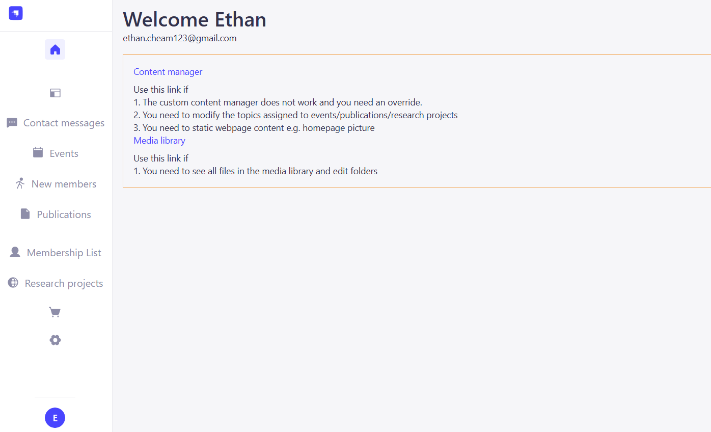
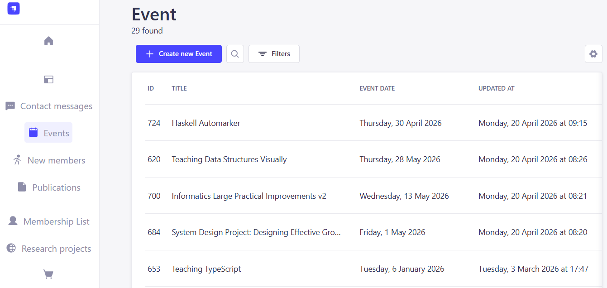
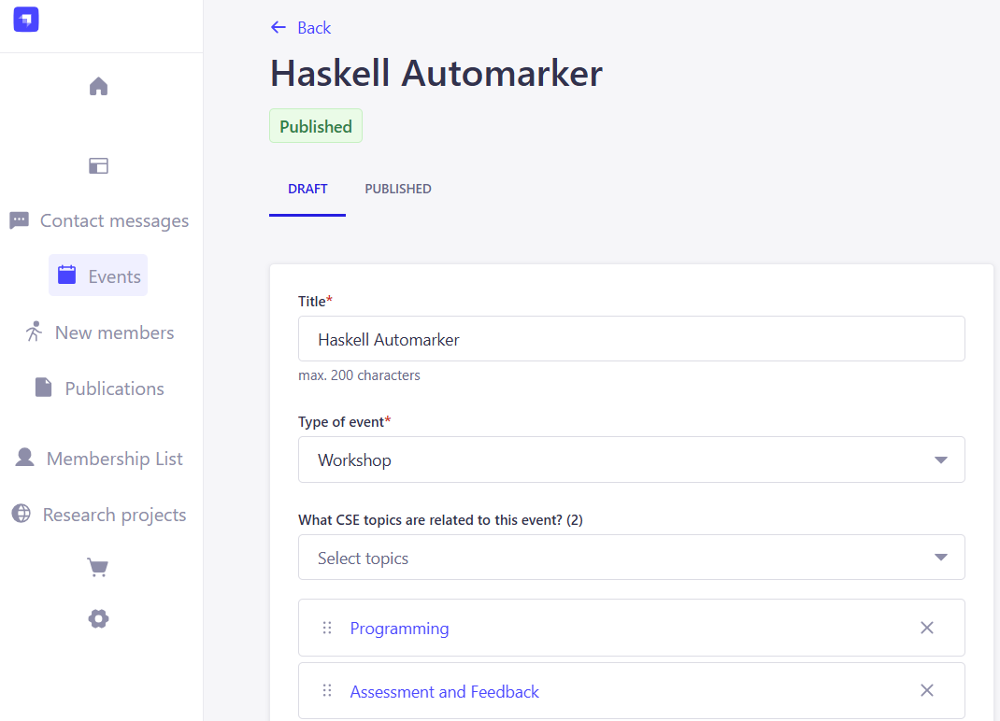
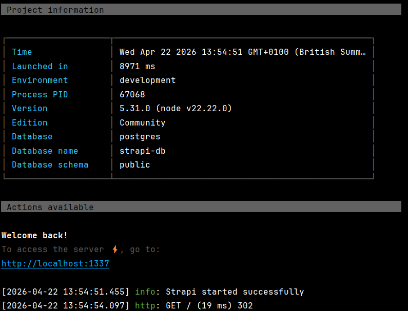
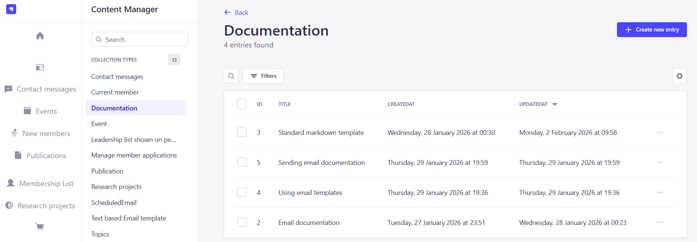
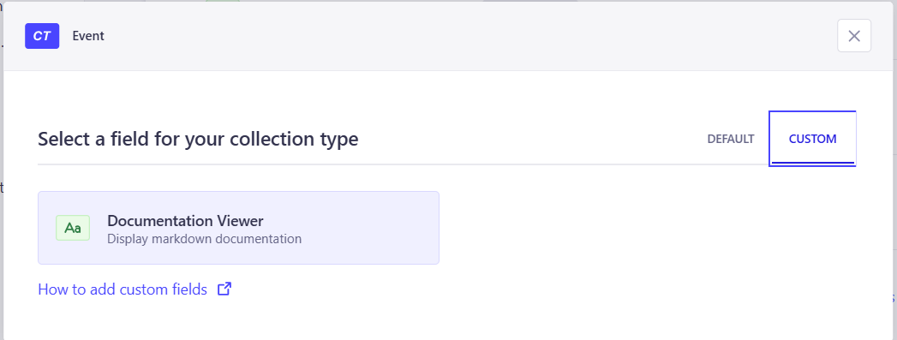

# Previous student notes
This is the backend / admin panel for the Computer Science Education Group (CSEG)'s new website created by
Ethan Cheam Kai Jun for for his undergraduate dissertation in 2026.

Key features include
- Uploading events, research projects and publications.
- Managing contact requests and member applications. Organisers sent notifications when new contact requests or member applications are received.
- Sending of scheduled email reminders for events

Screenshots of the admin panel:



Dashboard



List of events



Event creation form
## Setup
### Rule for plugin builds
- Run `npm run build:plugins` only on:
  1. first installation, or
  2. production builds/deployments.
- For normal CCM development, use `strapi-plugin watch` for hot reloading and do not rerun `build:plugins` on every edit.

### 1) Setup for development mode on laptop (Windows PowerShell)

#### 1.1 Open PowerShell in repo root
`cseg-strapi`

#### 1.2 Check Node/npm versions (Node must be 20-24)
```powershell
node -v
# I use v22.22.0
```

#### 1.3 Install dependencies
```powershell
npm install
```

#### 1.4 Build plugins once (first install only)
```powershell
npm run build:plugins
```

#### 1.5 Create DB/user (login once, run SQL, quit)
```powershell
psql -U postgres
```

```sql
CREATE DATABASE "strapi-db";
CREATE USER strapiUser WITH PASSWORD 'YOUR_POSTGRES_PASSWORD';
GRANT ALL PRIVILEGES ON DATABASE "strapi-db" TO strapiUser;
\q
```

#### 1.6 Add DB password to `.env`
Set this value in `./.env`:
```env
DATABASE_PASSWORD=YOUR_POSTGRES_PASSWORD
```

#### 1.7 Load database dump
```powershell
psql -U strapiUser -d strapi-db -h localhost -f strapi_backup.sql
```

#### 1.8 Start CCM hot reload (terminal A)
Open terminal in `src/plugins/custom-content-manager3`:
```powershell
strapi-plugin watch
```

#### 1.9 Start Strapi dev server (terminal B)
Open terminal in `cseg-strapi`:
```powershell
npm run develop
```



Admin URL: `http://localhost:1337/admin`

### 2) Setup for production on laptop

Open terminal in `cseg-strapi`:
```powershell
npm install
npm run build:plugins
npm run build
npm run start
```

### 3) Sending website to DICE

#### 3.1 Export DB dump from laptop
Open terminal in `cseg-strapi`:
```powershell
pg_dump -U strapiUser -d strapi-db --clean --if-exists | Out-File -Encoding utf8 strapi_backup.sql
```
Password is found in the .env file under `DATABASE_PASSWORD`.

#### 3.2 Copy dump to DICE through gateway
Ask the university to give you a DICE server (I had `s2312606vm.inf.ed.ac.uk`), then replace `YOUR_UNN` and `YOUR_UNNvm` in the command below and run it in terminal from repo root:
```powershell
scp -J YOUR_UNN@student.ssh.inf.ed.ac.uk strapi_backup.sql YOUR_UNN@YOUR_UNNvm.inf.ed.ac.uk:~/
```
File should appear in the  `~/` (home) directory

#### 3.3 Push latest code
```powershell
git add .
git commit -m "Prepare DICE deploy"
git push
```

### 4) Setup for production on DICE

#### 4.1 SSH into DICE
```bash
ssh -J YOUR_UNN@student.ssh.inf.ed.ac.uk YOUR_UNN@YOUR_UNNvm.inf.ed.ac.uk
```

#### 4.2 Clone repo and install
```bash
git clone YOUR_REPO_URL
cd CSEG-strapi
npm install --legacy-peer-deps
```

#### 4.3 Build plugins + build Strapi (with memory flag if you get OOM on run build)
```bash
# In the CSEG-strapi folder containing package.json
npm run build:plugins
# NODE_OPTIONS gives more memory to Node to prevent OOM errors
NODE_OPTIONS="--max-old-space-size=4096" npm run build
```

Troubleshooting:
1. This means strapi-plugin is absent
```bash
[s2312606vm]s2312606: npm run build:plugins

> cseg-website@0.1.0 build:plugins
> node scripts/build-plugins.js

Building plugin: contact-plugin

> contact-plugin@0.0.0 build
> strapi-plugin build

sh: line 1: strapi-plugin: command not found
✗ Failed to build contact-plugin: Command failed: npm run build
```
Try `npm install --legacy-peer-deps` again to ensure strapi-plugin is installed

2. This error means the dist directory was deleted / not yet built so must be rebuilt. 
```bash
 Could not resolve "../../src/plugins/custom-content-manager3/./dist/admin/index.mjs" from        ││   ".strapi/client/app.js"  
```
Try `npm run build:plugins` again. 

#### 4.4 Use DICE env file
```bash
cp .env.dice .env
nano .env
```

Set at least:
- `DATABASE_NAME=YOUR_UNN`
- `DATABASE_USERNAME=YOUR_UNN`
- `DATABASE_PASSWORD=YOUR_POSTGRES_PASSWORD`

#### 4.5 Restore DB on DICE postgres
```bash
psql -h pgteach`
# Setup password access
s2312606=> ALTER ROLE s2312606 WITH password 'YOUR_POSTGRES_PASSWORD';
\q
# Return to terminal to load dump
psql -h pgteach.inf.ed.ac.uk -d YOUR_UNN < ~/strapi_backup.sql

# (If needed) Manually opening psql
psql -h pgteach.inf.ed.ac.uk -d YOUR_UNN
```

#### 4.6 Start with PM2 which auto-restarts Strapi if it crashes
Install nvm (node version manager)
```bash
wget -qO- https://raw.githubusercontent.com/nvm-sh/nvm/v0.40.4/install.sh | bash
```
Source the bashrc file before any nvm command
Use nvm to install node 22.22
```bash
source ~/.bashrc
nvm install 22.22.0
nvm use 22.22.0
```

After using `nvm use 22.22.0`.
```bash
npm install -g pm2
PM2_HOME=/tmp/pm2_$USER pm2 start npm --name "strapi" -- run start
PM2_HOME=/tmp/pm2_$USER pm2 status
```

#### 4.7 Extra PM2 commands
```bash
# Run `nvm use 22.22.0` then enter CSEG-strapi folder containing package.json BEFORE executing this command
PM2_HOME=/tmp/pm2_$USER pm2 start npm --name "strapi" -- run start

# Can run from anywhere
PM2_HOME=/tmp/pm2_$USER pm2 stop strapi
PM2_HOME=/tmp/pm2_$USER pm2 restart strapi
PM2_HOME=/tmp/pm2_$USER pm2 delete strapi
PM2_HOME=/tmp/pm2_$USER pm2 status
PM2_HOME=/tmp/pm2_$USER pm2 logs strapi
PM2_HOME=/tmp/pm2_$USER pm2 monit
PM2_HOME=/tmp/pm2_$USER pm2 kill
```

Cool debug server that you hit on https://groups.inf.ed.ac.uk/s2312606vm/admin/
```
// server.js
const http = require('http');

const PORT = 1337; // change to whatever port you're testing

const server = http.createServer((req, res) => {
res.writeHead(200, { 'Content-Type': 'text/plain' });
res.end(`Hello from DICE! Port ${PORT} is open.\n`);
});

server.listen(PORT, '0.0.0.0', () => {
console.log(`Server running on port ${PORT}`);
});
```

#### 4.8 Key URLS
If you have the same Apache settings as me 
Admin panel: https://groups.inf.ed.ac.uk/s2312606vm/admin/
API: https://groups.inf.ed.ac.uk/s2312606vm/api/


### How to login to DICE after setting everything up
#### 4.1 SSH into DICE
```bash
ssh -J YOUR_UNN@student.ssh.inf.ed.ac.uk YOUR_UNN@YOUR_UNNvm.inf.ed.ac.uk
```

#### 4.6 Activate the correct node environment containing pm2
```bash
source ~/.bashrc
nvm use 22.22.0
pm2
# Result
#usage: pm2 [options] <command>
#
#pm2 -h, --help             all available commands and options
#pm2 examples               display pm2 usage examples
#pm2 <command> -h           help on a specific command
#
#Access pm2 files in ~/.pm2
```

#### 4.8 Important apache commands
```bash
cat /etc/apache2/apache2.conf
cat /etc/apache2/lcfg.sites.d/s2312606vm.conf
```

### Running on Strapi Cloud
1. Build plugins
2. Git add the plugins to track their dist files
3. Git push onto Strapi Cloud
4. Use Strapi transfer tool to stream database data to Strapi Cloud

## Key implementation details
### Navigating the Custom Content Manager (CCM)
#### 1) CCM responsibility boundaries
- Use `src/plugins/custom-content-manager3/` for admin UI behavior (routes, pages, actions, and hooks).
- Keep data validation and persistence rules in backend hooks/middlewares (`src/utils/*` and startup wiring in `src/index.ts`).

#### 2) File map (if you want X, edit Y)
- Change routes serviced by the CCM: `src/plugins/custom-content-manager3/admin/src/router.tsx`
- Add reusable UI logic/hooks (but not the UI component itself): `src/plugins/custom-content-manager3/admin/src/hooks/`
- Change list view behavior: `src/plugins/custom-content-manager3/admin/src/pages/ListView/`
- Add create/edit action panel UI. The action panel has the 'Publish onto public website' button: `src/plugins/custom-content-manager3/admin/src/pages/EditView/components/Panels.tsx`
- Add menu links into CCM from thin plugins: `src/plugins/*/admin/src/index.ts`

#### 3) CCM change workflow (hot reload)
1. Start plugin watch mode in `src/plugins/custom-content-manager3`: `strapi-plugin watch`.
2. Run Strapi from repo root: `npm run develop`.
3. Edit CCM files under `src/plugins/custom-content-manager3/admin/src/`.
4. Refresh page

#### 4) Data flow cheat sheet (Publish button in EditView)
What happens when you click the Publish button?
- `src/plugins/custom-content-manager3/admin/src/pages/EditView/components/Panels.tsx` mounts `<PublishButton />` inside `StandardActionPanel`.
- `src/plugins/custom-content-manager3/admin/src/action-buttons/PublishButton.tsx` wires button `onClick` to `usePublishAction(...).onClick`.
- `src/plugins/custom-content-manager3/admin/src/hooks/usePublishAction.tsx` runs `performPublish()`, validates form data, then calls `publish(...)` from `useDocumentActions`.
- `src/plugins/custom-content-manager3/admin/src/hooks/useDocumentActions.ts` uses `usePublishDocumentMutation` and calls `publishDocument(...)`.
- `src/plugins/custom-content-manager3/admin/src/services/documents.ts` executes POST `/content-manager/${collectionType}/${model}/${documentId}/actions/publish` (or single-type equivalent).


#### 5) Common modification patterns
- Add a new action button: create hook/action file, then mount it in list/edit page components.
- Add a custom list page: register route in `router.tsx`, then implement under `pages/ListView/`.
- Add form-side helper UI: wire component into `Panels.tsx` and connect via a hook in `hooks/`.

#### 6) Troubleshooting CCM edits
- Change not visible: confirm `strapi-plugin watch` is still running in `src/plugins/custom-content-manager3`, then hard-refresh admin.
- Route missing: confirm it is registered in `router.tsx` and linked from plugin entry points.
- Save fails but UI looks correct: debug backend middlewares/hooks in `src/utils/` and `src/index.ts`.

#### 7) Using in-place Documentation such as a the MarkDown template
1. On a Super Admin account, go to the dashboard and click the Content Manager link
2. Add a Documentation entry

3. On the Content Type Builder, add the Documentation custom field.

You can use the 'configure the view' button on the top of the CTB to move the field's position. 'configure the view'
is known to be fiddly so a solution is removing all fields from the view then adding the fields one at a time from
the top field.  

### Other implementation details

#### Email system
- Provider config is in `config/plugins.ts` (Gmail SMTP via `@strapi/provider-email-nodemailer`;
- Immediate notifications are handled by `src/utils/contact-middleware.ts` and `src/utils/member-application-middleware.ts`.
- Event reminder emails are scheduled (not sent immediately) by `src/utils/document-service-middlewares.ts` using `syncScheduledEmailSlot` in `src/utils/helper-functions.ts`.
- Scheduled emails are dispatched by cron in `config/cron-tasks.ts` using `sent`, `isSending`, and `failedAttempts` fields.

#### ICS generation
- Event ICS content is generated in `src/utils/eventICSMiddleware.ts` on `create`/`update` for `api::event.event`.
- The middleware writes `context.params.data.ics` before persistence, so ICS data is saved with the event write.
- ICS content is built by `handleEventICS` in `src/utils/helper-functions.ts` and uses `escapeICSText` + `foldICSLine` for RFC-safe output.

#### How middlewares work here
- Document-service middlewares are registered at startup in `src/index.ts` via `strapi.documents.use(...)`.
- Each middleware should guard early on `context.uid` + `context.action`, then return `next()` when irrelevant.
- Use `await next()` first for post-save side effects (emails/scheduling), and mutate `context.params.data` before `next()` only when data must be persisted in the same write.
- Keep business rules in backend middleware/lifecycle hooks, not only in CCM frontend code.

#### Required relation workaround
- Required relation checks are enforced by `validateRelations` in `src/utils/required-relations-custom.ts` based on https://github.com/teguru-labs/strapi-plugin-required-relation-field
- Used in event's schema.json. This is the 'one required field failed to validate' in dissertation text.
- The Content Type Builder sometimes accidentally deletes required:true when you edit the content type, so just manually add the required:true back.
```json
    "open_to": {
      "type": "relation",
      "relation": "manyToMany",
      "target": "api::member-type.member-type",
      "conditions": {
        "visible": {
          "!=": [
            {
              "var": "publicEvent"
            },
            true
          ]
        }
      },
      "inversedBy": "events",
      "required": true
    },
```

### Using the Admin panel use
There are two roles, Super Admin and Organiser. 
The Super Admin has links to the Content Manager and Media Library on the dashboard (`src/admin/extensions/CustomDashboard.tsx`). You can use the 
Content Manager to edit static webpage content e.g. homepage and the in-place documentation.

In-place documentation was implemented using a Strapi field (https://docs.strapi.io/cms/features/custom-fields) 

### Warnings

- Member approval side effects run after successful update in `src/utils/member-application-middleware.ts`. Keep this order (`await next()` first) so member creation/email does not happen when the application update fails.
- Event deletes should also remove linked scheduled emails; this is handled in `src/utils/document-service-middlewares.ts` via `deleteScheduledEmailsForEvent` in `src/utils/helper-functions.ts`.
- ICS generation in `src/utils/eventICSMiddleware.ts` uses incoming update payload fields. If date/time/title are omitted on update, `ics` can be regenerated as empty.
- Scheduled emails are operationally non-blocking: send/sync failures are logged and usually do not fail content writes (`src/utils/contact-middleware.ts`, `src/utils/member-application-middleware.ts`, `src/utils/document-service-middlewares.ts`).
- Cron timing in `config/cron-tasks.ts` should be reviewed carefully when changing `rule`; small format mistakes can change send frequency significantly.

- Beware of enterprise licensed code in
- history
- preview

#### Known bugs
1. When you delete an event, the scheduled email is not deleted. This is because the delete lifecycle hook does not have access to the event ID, so it cannot find and delete the scheduled email. You should fix it using the Document Service API to listen for deleted events.
2. Think carefully whether unpublishing an event from the website should affect scheduled emails if at all.

### Other technical notes
1. As stated in the dissertation, I strongly advise removing the whole 'allowed attendees' concept and just putting warning on event pages


# 🚀 Getting started with Strapi

Strapi comes with a full featured [Command Line Interface](https://docs.strapi.io/dev-docs/cli) (CLI) which lets you scaffold and manage your project in seconds.

### `develop`

Start your Strapi application with autoReload enabled. [Learn more](https://docs.strapi.io/dev-docs/cli#strapi-develop)

```
npm run develop
# or
yarn develop
```

### `start`

Start your Strapi application with autoReload disabled. [Learn more](https://docs.strapi.io/dev-docs/cli#strapi-start)

```
npm run start
# or
yarn start
```

### `build`

Build your admin panel. [Learn more](https://docs.strapi.io/dev-docs/cli#strapi-build)

```
npm run build
# or
yarn build
```

## ⚙️ Deployment

Strapi gives you many possible deployment options for your project including [Strapi Cloud](https://cloud.strapi.io). Browse the [deployment section of the documentation](https://docs.strapi.io/dev-docs/deployment) to find the best solution for your use case.

```
yarn strapi deploy
```

## 📚 Learn more

- [Resource center](https://strapi.io/resource-center) - Strapi resource center.
- [Strapi documentation](https://docs.strapi.io) - Official Strapi documentation.
- [Strapi tutorials](https://strapi.io/tutorials) - List of tutorials made by the core team and the community.
- [Strapi blog](https://strapi.io/blog) - Official Strapi blog containing articles made by the Strapi team and the community.
- [Changelog](https://strapi.io/changelog) - Find out about the Strapi product updates, new features and general improvements.

Feel free to check out the [Strapi GitHub repository](https://github.com/strapi/strapi). Your feedback and contributions are welcome!

## ✨ Community

- [Discord](https://discord.strapi.io) - Come chat with the Strapi community including the core team.
- [Forum](https://forum.strapi.io/) - Place to discuss, ask questions and find answers, show your Strapi project and get feedback or just talk with other Community members.
- [Awesome Strapi](https://github.com/strapi/awesome-strapi) - A curated list of awesome things related to Strapi.

---

<sub>🤫 Psst! [Strapi is hiring](https://strapi.io/careers).</sub>
